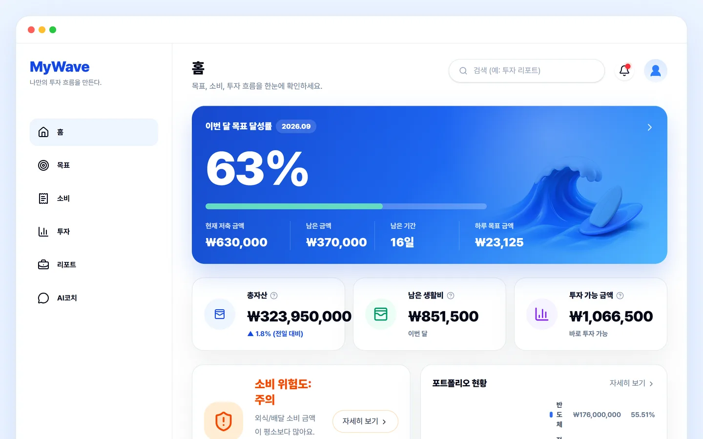
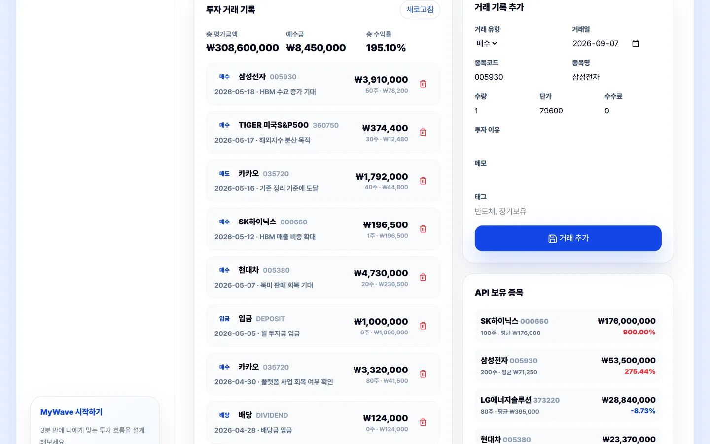
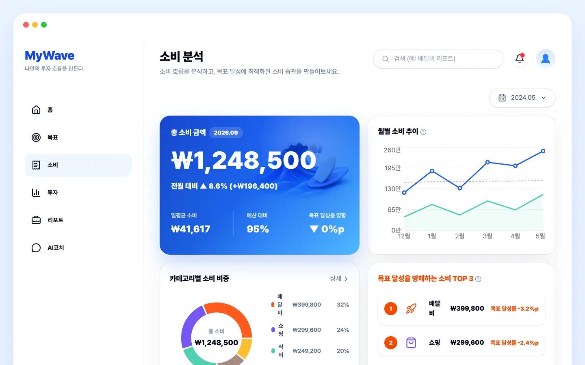
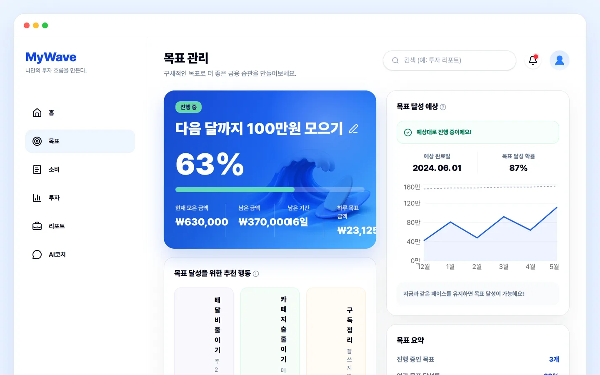
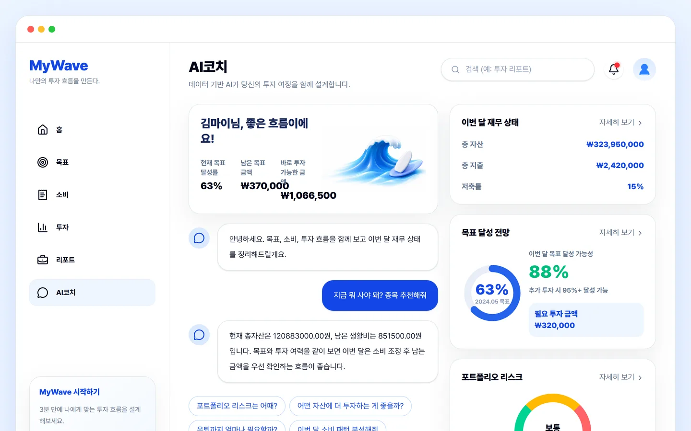

# MyStock-Desk

증권사 계좌에 연결하지 않고, 직접 입력한 매매 기록만으로 평균단가, 수익률, 자산 비중을 계산하는 개인 재무 웹앱입니다. 여기에 소비와 저축 목표를 같은 화면에 얹어서 "이번 달 얼마까지 투자해도 되는가"를 하나의 숫자로 보여 줍니다.



이름이 셋입니다. 저장소 이름은 `MyStock-Desk`, 자바 패키지는 `com.stockflow`, 화면에 뜨는 이름은 MyWave입니다. 2026-06-21 커밋에서 UI를 MyWave로 갈아엎었고, 그 앞의 이름들이 아래층에 그대로 남아 있습니다.

| | |
|---|---|
| 기간 | 2026.05.25 ~ 2026.06.22 (첫 커밋 `주식 체계 프론트 디자인`, 커밋 14개) |
| 인원 | 1명. 도메인 설계, Spring Boot API, React 화면 전부 |
| 배포 | 없음. 로컬에서만 동작합니다 (아래 "실행하기" 참고. 로그인 화면에 데모 계정 버튼이 있습니다) |
| 영상 | 없음 |
| 규모 | 백엔드 Java 214개 파일(테스트 7개 별도), 엔드포인트 98개, 엔티티 23개, 도메인 패키지 27개 |

## 주요 코드

1. [`Holding.buy()` / `sell()`](backend/src/main/java/com/stockflow/portfolio/entity/Holding.java#L39-L52). 이 서비스의 숫자를 전부 결정하는 14줄입니다. 매수는 직전 매입원가와 새 매입금액을 더해 나누고(이동평균), 매도는 수량만 줄이고 평균단가를 건드리지 않습니다. 이 차이가 "전량 매도 후 재매수"에서 수익률이 갈리는 지점입니다.
2. [`TransactionService.rebuildPortfolioFromTransactions()`](backend/src/main/java/com/stockflow/transaction/service/TransactionService.java#L306-L332). 거래 하나를 고치거나 지우면 보유 종목을 전부 지우고 거래 기록을 날짜순으로 다시 재생합니다. 증분 갱신을 쓰지 않은 이유는 아래 "설계 결정"에 있습니다.
3. [`ThemeAiExplanationService.explainWithOpenAi()`](backend/src/main/java/com/stockflow/theme/service/ThemeAiExplanationService.java#L46-L56). 이 저장소에서 언어 모델을 부르는 유일한 자리입니다. 지시문이 매수/매도 추천, 목표가, 상승 확률을 금지하고, 호출이 실패하면 규칙 기반 설명으로 내려갑니다.

## 주요 화면

| | |
|---|---|
|  |  |
| 이 서비스의 출발점입니다. 왼쪽 목록에 거래를 넣고 고치고 지우면, 오른쪽 "API 보유 종목"의 수량과 평균단가가 `Holding.buy()`를 다시 거쳐 나옵니다. 시세는 Yahoo Finance로 갱신하고, 갱신에 실패한 종목은 마지막 값을 유지합니다. | 소비를 카테고리로 묶어서 목표 달성률을 몇 %p 깎고 있는지로 환산합니다. 소비 화면이 투자 화면과 이어지는 지점입니다. |
|  |  |
| 저축 목표에 현재 페이스를 얹어 예상 완료일을 계산합니다. 소비를 줄였을 때 달성률이 어떻게 움직이는지가 "추천 행동"으로 붙습니다. | 총자산, 지출, 목표, 리스크를 한 화면에 모았습니다. 다만 이 화면의 답변은 언어 모델이 아니라 규칙이 만듭니다. 바로 아래에 적었습니다. |

이 밖에 계좌 수동 등록과 월 예산, 종목별 기업 상세(OpenDART 재무, SEC EDGAR 공시), 재무 리포트, 알림, 검색이 있습니다. 거래 등록, 수정, 삭제는 "투자 → 자세히 보기" 안에 있습니다.

## 설계 결정

### "AI"라고 적힌 화면이 넷인데 모델을 부르는 곳은 하나

AI 코치, AI 리포트, AI 요약, 테마 설명 넷 중 실제로 OpenAI를 호출하는 것은 테마 설명 하나뿐이고, 그마저 기본 설정이 `stockflow.ai.provider: local`이라 꺼져 있습니다. 나머지 셋은 전부 자바 규칙입니다. [`PortfolioReportService`](backend/src/main/java/com/stockflow/ai/service/PortfolioReportService.java)는 보유 비중과 손익 개수를 세어 문장을 조립하고, [`FinancialCoachService.answer()`](backend/src/main/java/com/stockflow/coach/service/FinancialCoachService.java#L70-L92)는 질문에 "투자, 소비, 목표"가 들어 있는지만 보는 4갈래 분기입니다.

이렇게 둔 이유는 하나입니다. 이 화면에서 모델이 종목 이름을 말하는 순간 투자 권유가 됩니다. 그래서 모델을 부르는 유일한 자리에는 지시문으로 매수/매도, 목표가, 상승 확률을 금지했고([`ThemeAiExplanationService#L50-L56`](backend/src/main/java/com/stockflow/theme/service/ThemeAiExplanationService.java#L50-L56)), 규칙으로 쓰는 리포트에는 마지막 필드에 면책 문장을 데이터로 넣어서 화면이 지울 수 없게 했습니다([`PortfolioReportService#L56`](backend/src/main/java/com/stockflow/ai/service/PortfolioReportService.java#L56)).

대가는 코치 화면입니다. 실행해서 "지금 뭐 사야 돼? 종목 추천해줘"를 넣어 봤더니 돌아온 답은 거절이 아니라 기본 분기의 총자산 요약이었습니다. 종목을 말하지 않는다는 목적은 지켰지만, 거절하도록 만든 것이 아니라 말할 줄 몰라서 그런 것입니다. 4갈래 밖의 질문은 전부 같은 문장으로 떨어집니다. 규칙으로 안전을 확보한 대신 대화가 없습니다.

### 거래를 고치면 보유를 고치지 않고 처음부터 다시 계산

거래 기록은 사용자가 나중에 수정하고 삭제합니다. 보유 수량과 평균단가를 그때그때 더하고 빼면, 5월 매수 기록의 단가를 고치는 순간 그 뒤에 쌓인 모든 평균단가가 조용히 틀어집니다. 틀린 것을 알 방법도 없습니다.

그래서 등록, 수정, 삭제 세 경로 전부가 [`rebuildPortfolioFromTransactions()`](backend/src/main/java/com/stockflow/transaction/service/TransactionService.java#L306-L332)를 부릅니다. 보유 종목을 전부 지우고, 현금을 기준값으로 되돌리고, 거래를 날짜순으로 정렬해 처음부터 다시 재생합니다. 저장된 상태를 믿지 않고 매번 다시 만드는 방식입니다. 어떤 순서로 고쳐도 결과가 하나로 수렴하고, 각 거래의 실현손익도 재생 도중 다시 계산되어 저장됩니다([#L329](backend/src/main/java/com/stockflow/transaction/service/TransactionService.java#L329)).

대가는 거래 하나를 고칠 때 전체 거래 수 n에 비례해서 일한다는 것입니다. 지금은 시드가 종목 10개라 티가 나지 않고, 이 앱이 다루는 것은 한 사람의 매매 기록이라 n이 몇 천을 넘길 일이 잘 없다고 봤습니다. 넘긴다면 스냅샷을 찍고 그 뒤만 재생하는 것이 다음 순서입니다.

### 외부가 죽어도 화면이 사는 방식은 폴백이 아니라 갱신 건너뛰기

처음에는 Provider를 인터페이스로 두었으니 Yahoo가 죽으면 Demo로 자동 전환된다고 적어 두었습니다. 코드를 다시 읽으니 그렇지 않았습니다. [`YahooFinanceMarketDataProvider`](backend/src/main/java/com/stockflow/marketdata/provider/YahooFinanceMarketDataProvider.java#L19-L21)와 `DemoMarketDataProvider`는 `@ConditionalOnProperty`로 부팅 때 하나만 뜨고, 실행 중에는 바뀌지 않습니다.

실제로 화면을 지키는 것은 두 곳입니다. 종목 조회가 실패하면 예외를 삼키고 `null`을 돌려주고([#L70-L72](backend/src/main/java/com/stockflow/marketdata/provider/YahooFinanceMarketDataProvider.java#L70-L72)), 갱신 루프는 `null`인 종목을 건너뜁니다([`MarketDataRefreshService#L66-L70`](backend/src/main/java/com/stockflow/marketdata/service/MarketDataRefreshService.java#L66-L70)). 그래서 시세는 마지막으로 성공한 값 그대로 남고 화면은 비지 않습니다. 결과는 의도한 대로지만 메커니즘은 폴백이 아닙니다.

그리고 이 안전망이 뉴스에는 기본으로 꺼져 있습니다. `stockflow.news.seed-fallback.enabled`의 기본값이 `false`라서, RSS가 빈 결과를 주면 [`NewsService.getNews()`](backend/src/main/java/com/stockflow/news/service/NewsService.java#L28-L41)는 시드 뉴스로 채우지 않고 빈 배열을 냅니다. `GET /api/news`를 종목 없이 호출해 `[]`를 받아 확인했습니다. "외부가 실패하면 시드로 보정한다"는 옛 README의 문장은 시세에만 맞고 뉴스에는 틀렸습니다.

### 모든 외부 숫자가 출처를 달고 다님

한 화면에 실데이터와 데모 데이터가 섞이면 읽는 사람이 구분할 수 없습니다. 그래서 응답 DTO마다 출처 문자열을 실었습니다. 재무제표는 키가 없으면 `demo-public-disclosure`, OpenDART를 실제로 타면 `DART OpenAPI`로 바뀝니다. 공시와 뉴스에는 등급까지 붙습니다. SEC EDGAR는 `OFFICIAL`, `officialSource: true`([`SecDisclosureProvider#L97`](backend/src/main/java/com/stockflow/disclosure/provider/SecDisclosureProvider.java#L97)), Google News RSS는 `AGGREGATED`, `false`([`GoogleNewsRssProvider#L80-L81`](backend/src/main/java/com/stockflow/news/service/GoogleNewsRssProvider.java#L80-L81))입니다.

## 외부 연동 확인

배포본이 없어서 성능을 잰 수치는 없습니다. 대신 저장소를 그대로 받아 로컬에서 띄우고 외부 연동 네 곳이 지금도 살아 있는지만 확인했습니다.

| 외부 | 확인한 요청 | 응답 |
|---|---|---|
| Yahoo Finance chart | `POST /api/data/refresh` | 시드 종목 10개 시세 갱신 |
| Google News RSS | `GET /api/news?symbol=005930` | 삼성전자 관련 실제 기사 (출처 `매일경제 마켓 / Google News RSS`) |
| OpenDART | `GET /api/stocks/005930/financials` | 2026년 1분기 재무, `source: DART OpenAPI` (`DART_API_KEY` 있을 때) |
| SEC EDGAR | `GET /api/disclosures/sec` | NVDA FORM 4, `reliability: OFFICIAL` |

(2026-09-07, Windows 11, Java 17, `SPRING_PROFILES_ACTIVE=default`의 H2 인메모리, 시드 종목 10개, 각 1회. `DART_API_KEY`가 없으면 재무는 시드로 남고 `source`가 `demo-`로 표시됩니다. 위 화면 캡처 다섯 장도 같은 실행에서 1440×900으로 찍었습니다.)

## 남은 과제

한 달을 혼자 개발하면서 UI를 한 번 갈아엎었고, 그때 정리하지 못한 것이 그대로 남아 있습니다. 다음에 손댈 순서대로 적었습니다.

- 옛 화면 열한 장이 코드에 남아 있는데 어디서도 안 열립니다. [`App.tsx`](frontend/src/App.tsx)는 다섯 줄이고 `<MyWaveApp />` 하나만 렌더합니다. MyWave로 갈아엎을 때 `src/pages/`의 StockFlow 화면 12장 중 `AuthPage`만 재사용했고, 나머지 11장(4,414줄, 그중 `FinancialAnalysisPage.tsx` 하나가 1,661줄)은 라우트에서 끊겼습니다. 지웠어야 했습니다.
- `MyWaveApp.tsx`가 3,751줄 한 파일입니다. 라우팅, 레이아웃, 페이지 컴포넌트 열여덟 개가 전부 여기 있습니다.
- 위에서 모델에 금지한 셋을 정작 화면이 정적 문구로 띄웁니다. 홈의 "관련 기업 분석 미리보기" 카드에 `투자 의견: 매수`, `목표가(12M) $210.00`, `상승 여력 +22.4%`가 하드코딩되어 있습니다([`MyWaveApp.tsx CompanyPreview`](frontend/src/mywave/MyWaveApp.tsx#L1999-L2001)). 디자인 시안을 그대로 남긴 자리이고, 이 저장소에서 제일 먼저 지워야 할 코드입니다.
- 화면 위쪽 "보유 종목 현황" 표는 DB가 아니라 고정 데이터를 그립니다. 런타임 데이터를 채우는 `setData({...defaultRuntimeData, …})`가 `holdings`와 `activities`만 갈아끼우지 않아서([#L243-L254](frontend/src/mywave/MyWaveApp.tsx#L243-L254)), API가 정상으로 붙어도 `myWaveData.ts`의 `AAPL, NVDA, VOO, KO`가 그대로 남습니다. 실제 보유 종목은 삼성전자와 SK하이닉스인데도 그렇습니다. 위 캡처 오른쪽의 "API 보유 종목" 패널만 진짜 값이고, 같은 페이지 위쪽 표는 끝까지 `AAPL`을 띄웁니다.
- 리포트 화면의 "삼성전자 재무 상태 요약" 본문과 다섯 개 지표 카드도 백엔드에서 오지 않습니다([`ReportsPage`](frontend/src/mywave/MyWaveApp.tsx#L665-L690)). 실제 OpenDART 수치가 화면에 닿는 곳은 기업 상세(`/company/:symbol`) 하나뿐입니다.
- 외부에서 온 시세를 범위 검증 없이 그대로 씁니다. 갱신 뒤 SK하이닉스 현재가가 평균단가의 정확히 10배로 들어와 수익률이 `900.00%`로 찍혔습니다(위 캡처 오른쪽). 값이 들어오는 길에 자릿수나 변동폭을 확인하는 곳이 한 군데도 없습니다.
- 프론트에도 조용한 폴백이 있습니다. `CompanyDetailPage`는 `fallbackCompanyAnalysis()`로 먼저 그리고 API 응답이 오면 갈아끼우며, 실패하면 그대로 둡니다([#L3293-L3316](frontend/src/mywave/MyWaveApp.tsx#L3293-L3316)). 백엔드가 죽어도 그럴듯한 숫자가 뜨고 화면에는 아무 표시가 없습니다. 백엔드가 출처 문자열까지 실어 보내는 것과 정반대입니다.
- AI 코치 답변에 `BigDecimal.toPlainString()`이 그대로 나갑니다. 화면에 `120883000.00원`이라고 뜹니다([`FinancialCoachService#L87-L89`](backend/src/main/java/com/stockflow/coach/service/FinancialCoachService.java#L87-L89)).
- 거래 CSV 가져오기(`POST /api/transactions/import/csv`)는 백엔드에만 있고 지금 UI에서 열 수 없습니다. 위의 끊긴 화면에 딸려 나갔습니다.
- 테스트가 9개뿐이고 전부 `@SpringBootTest` 흐름 테스트입니다. 정작 숫자를 결정하는 `Holding.buy()`/`sell()` 같은 순수 계산에는 단위 테스트가 없습니다. "전량 매도 후 재매수"처럼 평균단가가 어긋나기 쉬운 경우를 잠가 두지 않았습니다.
- `application-mysql.yml`의 DB 비밀번호와 JWT 시크릿에 기본값이 박혀 있습니다. 환경변수로 덮이긴 하지만 값 자체가 저장소에 있으면 안 됩니다. 전부 `${ENV}`로만 받게 바꿔야 합니다.
- `CurrentMemberProvider`는 인증이 없으면 회원 1번으로 떨어집니다. 지금은 `SecurityConfig`가 모든 요청에 인증을 걸어 막고 있지만, 한 사람만 쓰던 시절의 코드가 남은 것입니다.
- 커밋이 14개이고 메시지가 "전체적인 기능 추가" 같은 뭉텅이입니다. 한 달을 혼자 빠르게 개발하던 흔적이고, 지금은 무엇을 왜 바꿨는지 적고 있습니다.

## 실행하기

<details>
<summary>백엔드 8080, 프론트 5173. 프로파일을 안 바꾸면 MySQL을 찾습니다</summary>

필요한 것: Java 17, Node 20 이상. DB 없이 띄우려면 프로파일을 바꿔야 합니다.

**백엔드.** `application.yml`의 기본 프로파일이 `mysql,local`이라 그냥 실행하면 `localhost:3306`을 찾습니다. H2 인메모리로 띄우려면:

```bash
cd backend
SPRING_PROFILES_ACTIVE=default ./gradlew bootRun     # Windows: .\gradlew.bat bootRun
```

MySQL로 붙일 때는 프로파일을 그대로 두고 `SPRING_DATASOURCE_URL`, `SPRING_DATASOURCE_USERNAME`, `SPRING_DATASOURCE_PASSWORD`, `STOCKFLOW_JWT_SECRET`을 환경변수로 줍니다. `docker compose up`이면 MySQL 8.4, 백엔드, 프론트가 한 번에 뜹니다(`docker-compose.yml`).

부팅 때 `DataSeeder`가 종목 10개, 보유와 거래 기록, 목표, 소비, 계좌를 채워 넣고 데모 회원 하나를 만듭니다. 로그인 화면의 "데모 계정으로 로그인" 버튼이 그 계정으로 들어갑니다.

**프론트.**

```bash
cd frontend && npm install && npm run dev
```

`frontend/.env.example`이 그대로 기본값입니다. `VITE_API_BASE_URL`(기본 `http://localhost:8080`), `VITE_ALLOW_MOCK_FALLBACK`. 백엔드 포트를 바꿨으면 프론트도 같이 바꿔야 하고, CORS 허용 목록이 `localhost:5173`, `127.0.0.1:5173`, `localhost:3000` 세 개뿐이라([`CorsConfig#L13`](backend/src/main/java/com/stockflow/global/config/CorsConfig.java#L13)) 프론트 포트는 그대로 두는 편이 낫습니다.

**선택 환경변수.** 없으면 그 기능만 시드나 규칙으로 내려가고 앱은 뜹니다.

| 변수 | 없을 때 |
|---|---|
| `DART_API_KEY` | 재무제표가 시드로 남고 `source`가 `demo-`로 표시됩니다 |
| `OPENAI_API_KEY` (+ `stockflow.ai.provider: openai`) | 테마 설명이 규칙 기반 로컬 설명으로 나갑니다 |
| `SEC_USER_AGENT` | SEC EDGAR에 예시 User-Agent로 요청합니다. 실제로 쓸 거면 연락처를 넣어야 합니다 |

Windows OneDrive 경로에서 Gradle이 `.class` 동기화 때문에 실패하는 것을 피하려고, 백엔드 빌드 산출물은 OS 임시 폴더의 `stockflow-backend-build`에 만들어집니다([`build.gradle#L11`](backend/build.gradle#L11)).

</details>

<details>
<summary>폴더</summary>

```text
backend/src/main/java/com/stockflow/   도메인 패키지 27개 (각 controller, dto, entity, repository, service)
  portfolio, transaction, trade        보유, 거래, 평균단가. 숫자가 정해지는 곳
  marketdata, news, earnings/dart, disclosure   외부 연동 (Yahoo, Google News RSS, OpenDART, SEC EDGAR)
  asset, expense, goal, coach, dashboard        MyWave 쪽 (계좌, 소비, 목표, 코치, 대시보드)
  ai, research, theme, global, seed             정리형 리포트, 공통 설정, 시드 데이터
frontend/src/   mywave/MyWaveApp.tsx(현재 앱 전체), pages/(옛 화면, AuthPage만 사용), api, components
```

</details>

## 만든 사람

정재훈, 아주대학교. 다른 작업은 [포트폴리오](https://jaehun.co.kr)와 [GitHub](https://github.com/toadsam)에 있습니다.

이 서비스는 투자 기록 관리와 참고 정보 제공만 합니다. 실제 주문, 체결, 계좌 연동 기능은 없고, 화면의 어떤 문장도 투자 자문이 아닙니다.

코드와 화면은 포트폴리오 공개 목적이며, 별도 표기 전까지 무단 사용, 복제, 배포를 허용하지 않습니다.
